<h2 align="center">Traffic Sign Classification using Convolutional Neural Network:grinning:</h2>

<p align="center">
  
</p>
<p align="center">
  <strong>Junth Basnet, Sandip Dulal, Abin Sainju</strong>
</p>

---


In this work, we propose a novel deep network for traffic sign classification that achieves outstanding performance on `GTSRB` surpassing the best human performance of `98.84%` :smiley:.We apply Convolutional Networks (ConvNets) to the task of traffic sign classification. ConvNets are biologically-inspired multi-stage architectures that automatically learn hierarchies of invariant features.We have achieved the state-of-the-art performance of `99.22%` on GTSRB dataset. Compared with other algorithms, the proposed algorithm has remarkable accuracy and real-time performance, strong generalization ability and high training efficiency.

---

# Introduction
Traffic signs classification is one of the foremost important integral parts of autonomous vehicles and **advanced driver assistance systems (ADAS)**. Most of the time driver missed traffic signs due to different obstacles and lack of attentiveness. Automating the process of classification of the traffic signs would help reducing accidents. Traditional computer vision and machine learning based methods were widely used for traffic signs classification. but those methods were soon replaced by deep learning based classifiers. Recently deep convolutional networks have surpassed traditional learning methods in traffic signs classification. With the rapid advances of deep learning algorithm structures and feasibility of its high performance implementation with graphical processing units (GPU), it is advantageous to relook the traffic signs classification problems from the efficient deep learning perspective. Classification of traffic signs is not so simple task, images are effected to adverse variation due to *illumination, orientation, the speed variation of vehicles* etc. Normally wide angle camera is mounted on the top of a vehicle to capture traffic signs and other related visual features for ADAS. This images are distorted due to several external factors including vehicles speed, sunlight, rain etc. Sample images from GTSRB dataset are shown in Figure.
<p align="center">
  
</p>

# Dataset
This paper uses the `German Traffic Sign Recognition Benchmark (GTSRB)`, which was presented at the 2011 **International Joint Conference on Neural Networks (IJCNN)**. The internal traffic signs are collected from the real road traffic environment in Germany, and it has become a common traffic sign dataset used by experts and scholars in computer vision, self-driving, and other fields. The `GTSRB` comprises `51,839 images` in `43 classes`, which are divided into training and testing sets. A total of `39,209` and `12,630` images are provided in the training and testing sets, accounting for approximately `75%` and `25%` of the whole, respectively. Each image contains only one traffic sign, which is not necessarily located in the center of the image. The image size is unequal; the maximum and smallest images are `250 x 250` and `15 x 15 pixels`, respectively.

The dataset provided by the `GTSRB competition` presents a number of difficult challenges due to real-world variabilities such as *viewpoint variations, lighting conditions (saturation, low-contrast), motion-blur, occlusions, sun glare, physical damage, colors fading, graffiti, stickers* and an input resolution as low as `15 x 15`. Although signs are available as video sequences in the training set, temporal information is not in the test set. The present project aims to build a robust recognizer without temporal evidence accumulation. Sample images from the `GTSRB dataset` are shown in Figure above and the distribution of images per sample is not uniform as shown in Figure.

Dataset for this project is available at: https://www.kaggle.com/meowmeowmeowmeowmeow/gtsrb-german-traffic-sign.
<p align="center">
  
</p>

# Image Preprocessing
All images are down-sampled or up-sampled to `32 x 32` (dataset samples sizes vary from `15 x 15` to `250 x 250`).The ROI in the traffic sign training image is not `100%` in the center of the image, and some edge background information is included around the traffic sign. With the change of illumination conditions, these useless interference areas will increase the influence on traffic sign recognition, thereby undoubtedly raising the computational complexity of the training network and the misrecognition rate of traffic signs. Therefore, image preprocessing is necessary. **Image preprocessing** mainly includes the following three stages:

## Contrast Limited Adaptive Histogram Equalization (CLAHE)
We used `Scikit histogram equalization function`, which not only normalizes the images but also enhances local contrast. `CLAHE` is an algorithm for local contrast enhancement, that uses histograms computed over different tile regions of the image. This approach enhances an image with low contrast, using a method called `histogram equalization`, which “spreads out the most frequent intensity values” in an image.Sample of histogram equalized images is shown in Figure. 
<p align="center">
  
</p>
The equalized image has a roughly linear cumulative distribution function as shown in Figure.
<p align="center">
  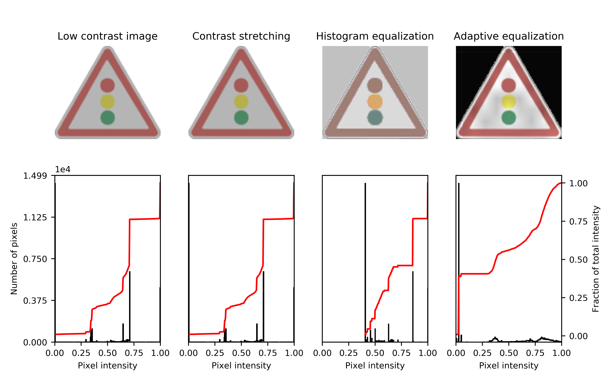
</p>

## Image Augmentation
**Traffic signs classification** are affected due to `contrast variation, rotational and translational changes`. It is possible to nullify the effect of spatial transformations in an image undergo due to varying speed of vehicles camera by using multiple transformations to the input image.
 
| Augmentation Version   | Images per class      |
| ---------------------- | --------------------- |
| Augmentation version 1 | `3000` images per class |
| Augmentation version 2 | `4500` images per class |

ConvNets architectures have built-in invariance to small translations, scaling and rotations. When a dataset does not naturally contain those deformations, adding them synthetically will yield more robust learning to potential deformations in the test set.Other realistic perturbations would probably also increase robustness such as other affine transformations, brightness, contrast and blur.**ImageDataGenerator class generates batches of tensor image data with real-time data augmentation**.Sample of augmented images is shown in Figure.
<p align="center">
  
</p>

## Grayscaling
**Converting an image with RGB channels into an image with a single grayscale channel**. The value of each grayscale pixel is calculated as the weighted sum of the corresponding red, green and blue pixels as: `Y = 0.2125 R + 0.7154 G + 0.0721 B`.
The grayscaled training images sample is shown in Figure.
<p align="center">
  
</p>

# Model Architecture
Our model follows the guideline of classical LeNet-5 Convolutional Neural Network with modification. Our First model is `LeNet-5`. After explorations, we build our second model `LeNet-5 + Contrast Enhancement`. The we used augmented dataset to the second model instead of original training images, `LeNet-5 + Contrast Enhancement + Augmentation(3000)` to reduce overfitting. The fourth model is `Deep LeNet-5 + Contrast Enhancement + Augmentation(3000)` and the fifth model is `Deep LeNet-5 + Contrast Enhancement + Augmentation(4500) + Regularization`. The details of the five models are discussed in this section.

### 1. LeNet-5 :pensive:
Professor `Yann Lecun` proposed the **LeNet-5** network model in `1998`, which was mainly used for digital recognition. The **LeNet-5** network model consists of seven layers, including two convolutional layers, two pooling layers, two fully-connected layers and one output layer.The input image size is `32 × 32`, and the output is a `10-dimensional classification vector`, which can identify numbers from `0 to 9`. The `classic LeNet-5` network model has good classification and recognition effects for a single target. However, in the traffic signs recognition training, it is difficult to ensure a high enough accurate recognition rate, the training network cannot converge, and the recognition efficiency of the network decreases dramatically. The learning rate and the iterations number of the training network are not adjusted accordingly,and the relevant parts are rationally optimized, thereby resulting in the emergence of the over-fitting phenomenon during training.

### 2. LeNet-5 + Contrast Enhancement :unamused:
We experimented with the same classical LeNet-5 Convolutional Neural Network as proposed in **Gradient-Based Learning Applied to Document Recognition** paper with the histogram equalized images rather than original training images.

### 3. LeNet-5 + Contrast Enhancement + Augmentation(3000) :confused:
**LeNet-5 + Contrast Enhancement + Augmentation(3000)** uses classical LeNet-5 Convolutional Neural Network with histogram equalized images and augmented dataset version 1 to reduce overfitting and increase generalization accuracy.
<p align="center">
  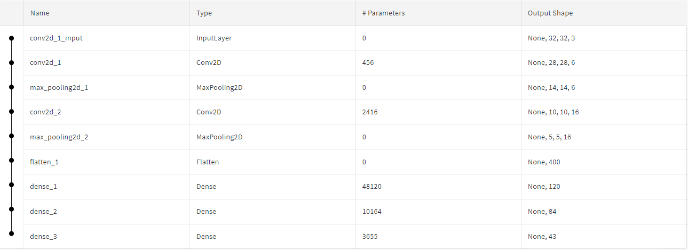
</p>

### 4. Deep LeNet-5 + Contrast Enhancement + Augmentation(3000) :relaxed:
**Deep LeNet-5 + Contrast Enhancement + Augmentation(3000)** has `2 more convolutional layers` than classical LeNet-5 network architecture and `dropout` layers are added to reduce overfitting.This model is used with histogram equalized and augmented dataset version 1 images.
<p align="center">
  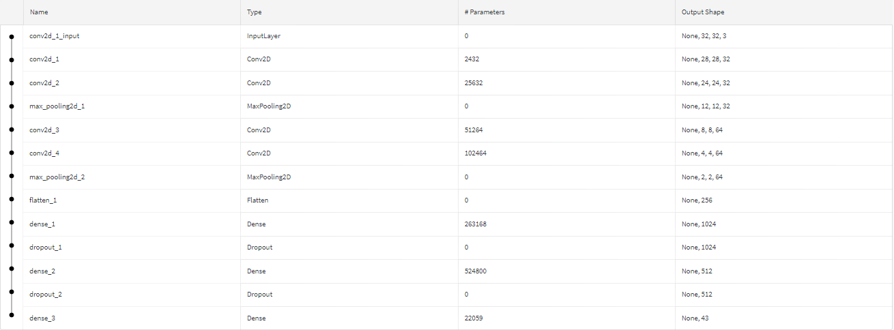
</p>

### 5. Deep LeNet-5 + Contrast Enhancement + Augmentation(4500) + Regularization :smiley:
**Deep LeNet-5 + Contrast Enhancement + Augmentation(4500) + Regularization** also has `2 more convolutional layers` than classical LeNet-5 network architecture. `Dropout and L2 Regularization` is also used in this model to reduce overfitting of model and increase generalization accuracy.Regularizers allow to apply penalties on layer parameters or layer activity during optimization. These penalties are incorporated in the loss function that the network optimizes.This model is applied to histogram equalized and augmented dataset version 2 images.
<p align="center">
  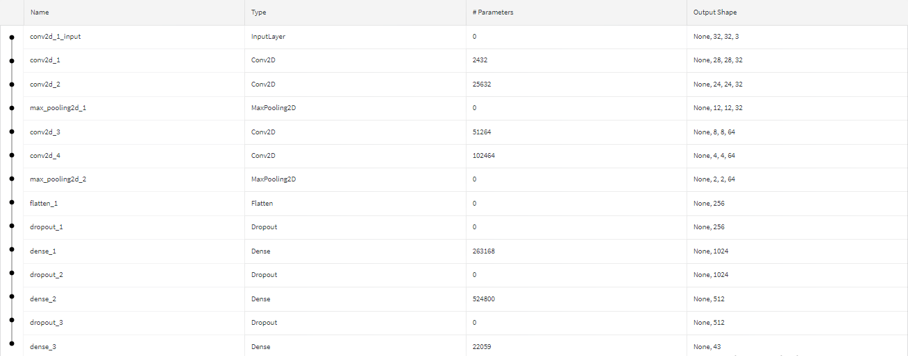
</p>

**ReLU Activation Function:**
> The ReLU function is selected as the activation function. Compared with the traditional Sigmoid and Tanh functions, the ReLU function is simple in calculation but effectively solves the gradient disappearance and explosion problem of the two functions. By making a part of the neuron output to 0, the network can be sparse, which helps reduce computational complexity and accelerate network convergence. Therefore, this function performs well in deep network training.

**Adam Optimizer:**
> Adam, an algorithm for first-order gradient-based optimization of stochastic objective functions, based on adaptive estimates of lower-order moments. The method is straightforward to implement, is computationally efficient, has little memory requirements, is invariant to diagonal rescaling of the gradients, and is well suited for problems that are large in terms of data and/or parameters.The method is also appropriate for non-stationary objectives and problems with very noisy and/or sparse gradients. The hyper-parameters have intuitive interpretations and typically require little tuning.The Adam method can effectively solve the problems of learning rate disappearance, slow convergence and large fluctuation of loss function in the optimization process, thereby possessing a good convergence mechanism.

**Softmax Function:**
> Deep learning solutions to classification problems usually employ the softmax function as their classification function (last layer).

**Dropout:**
> The dropout is added to the fully-connected layers.The key idea is to randomly drop units (along with their connections) from the neural network during training. This prevents units from co-adapting too much. During training, dropout samples from an exponential number of different “thinned” networks. At test time, it is easy to approximate the effect of averaging the predictions of all these thinned networks by simply using a single unthinned network that has smaller weights. This significantly reduces overfitting and gives major improvements over other regularization methods.

# Experiments
## Experimental Environment
**Software environment:**
```
Windows 10 64-bit operating system
PyCharm 2019.3(Professional Edition)
TensorFlow 2.1.0
Python 3.8.0 64-bit
Keras 2.3.1
```
**Hardware environment:**
```
Intel (R) Core (TM) i5-6500 CPU@3.20GHz processor.
8.00 GB memory.
2 TB mechanical hard disk.
```

## Hyperparameter Tuning
The proposed network was trained and tested using the machine learning framework `Keras`. We extensively evaluate our proposed deep networks on `GTSRB (German Traffic Sign Recognition Benchmark)` using our modified network architecture and also with original classical LeNet-5 Convolutional Neural Network.
<p align="center">
  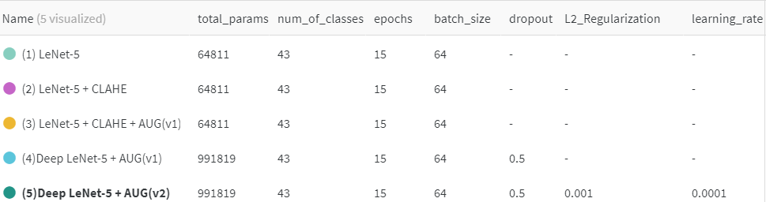
</p>

# Evaluation of Results (Evaluation Metrics)
`Root-Mean-Squared-Error (RMSE)` is used as performance evaluation criteria of different learning algorithms. We have achieved the state-of-the-art performance of `99.22%` on **GTSRB dataset**, which surpassed the best human performance of `98.84%`. Overall accuracy comparisons with different high performing approaches are shown in TABLE.
<p align="center">
  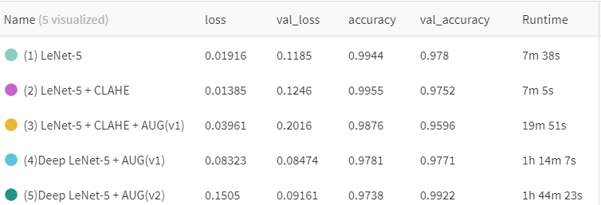
</p>

**Graphical Comparision** according to `validation accuracy` and `accuracy`.
<p align="center">
  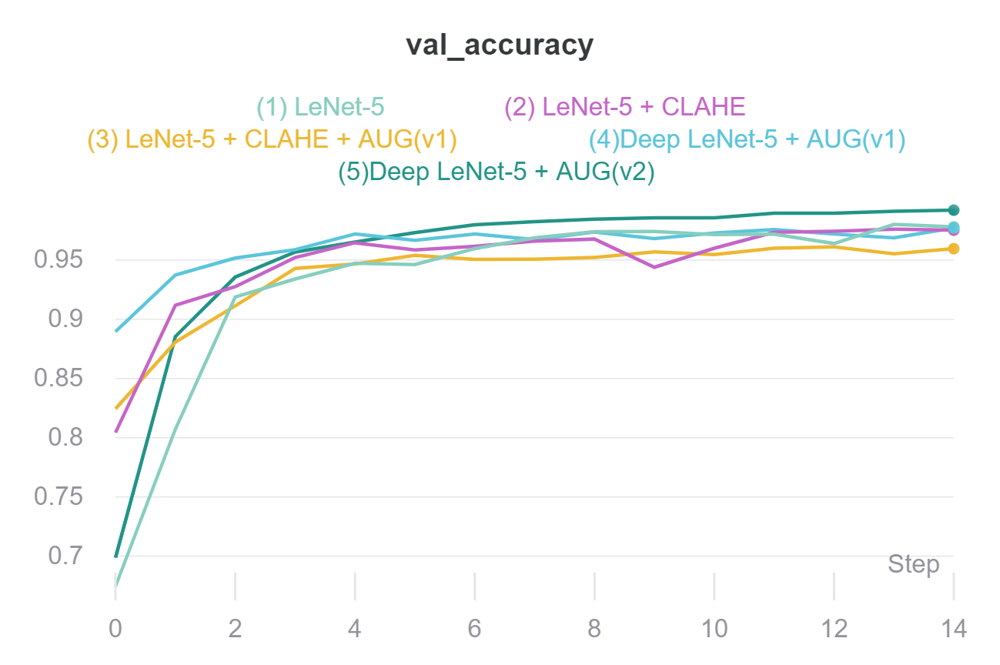          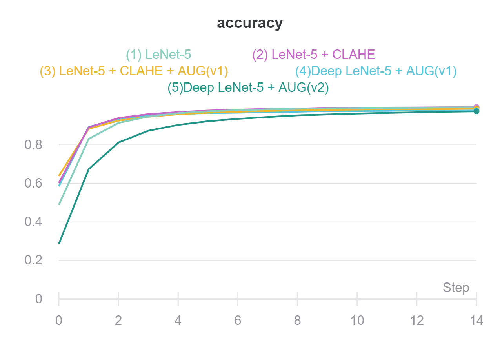
</p>

**Precision, Recall and F1-Score:** The precision, recall and F1-Score and support of `Deep LeNet-5 + Contrast Enhancement + Augmentation(4500) + Regularization` model is shown in TABLE.
<p align="center">
  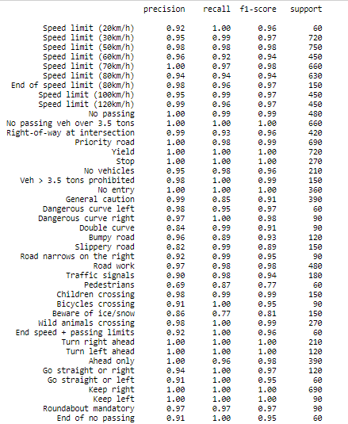
</p>
<p align="center">
  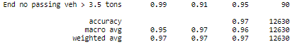
</p>

**Confusion Matrix:** Confusion matrix of `Deep LeNet-5 + Contrast Enhancement + Augmentation(4500) +
Regularization` is shown in Figure.
<p align="center">
  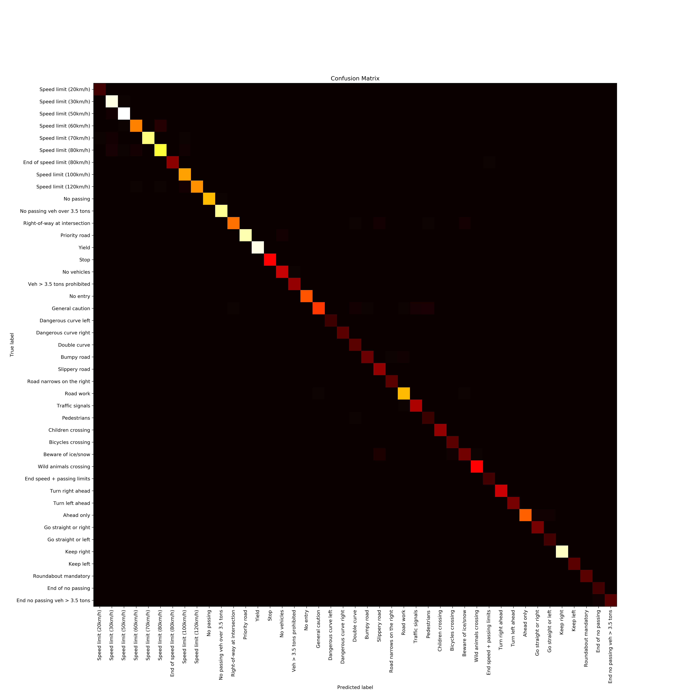
</p>

# Discussion on Results
We have achieved the state-of-the-art performance of `99.22%` on **GTSRB dataset**, which surpassed the best human performance of `98.84%`. As seen in comparision table above, the first three models are clearly overfitting. To reduce overfitting `dropout(50%)` is used in Fully Connected Layer of `Deep LeNet-5 + Contrast Enhancement + Augmentation(3000)` model and `2 Convolutional Layer` with `1024` and `512` neurons are added respectively. Finally, Augmented dataset version 2 containing `4500 images per sample` is introduced to the final model `Deep LeNet-5 + Contrast Enhancement + Augmentation(4500) + Regularization` and `L2 Regularization with 1e-3` is also used to increase the generalisation accuracy to `99.22%`.

# Predictions
Some prediction done by **Deep LeNet-5 + Contrast Enhancement + Augmentation(4500) + Regularization** model is shown.

<p align="center">
  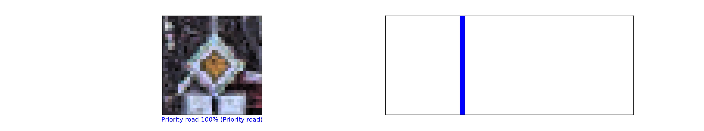
</p>
<p align="center">
  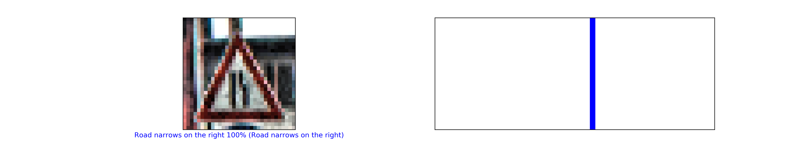
</p>
<p align="center">
  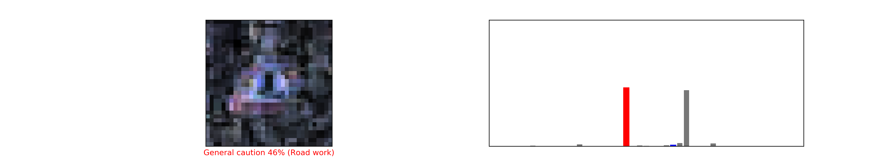
</p>
<p align="center">
  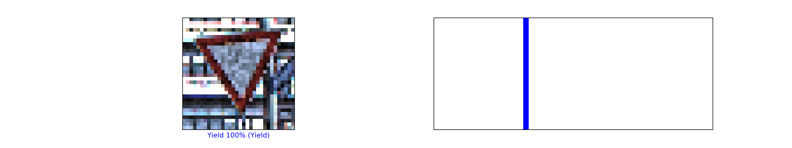
</p>
<p align="center">
  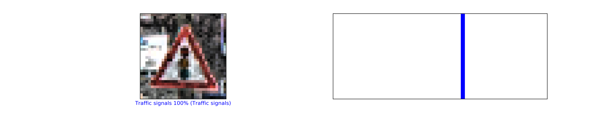
</p>
<p align="center">
  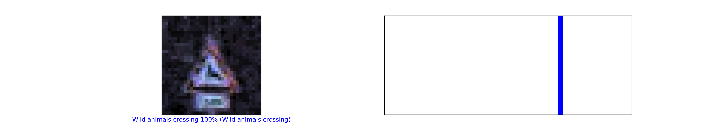
</p>
<p align="center">
  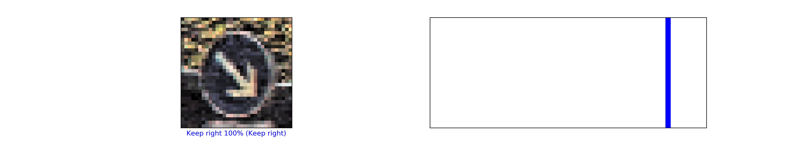
</p>
<p align="center">
  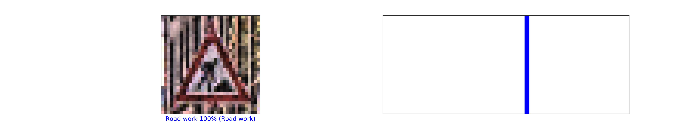
</p>

# Visualizing what convnets learn?
The representations learned by convnets are highly amenable to visualization, in large part because they’re representations of visual concepts.

## Visualizing intermediate convnet outputs (intermediate activations)
Visualizing intermediate activations consists of displaying the feature maps that are output by various convolution and pooling layers in a network, given a certain input.
<p align="center">
  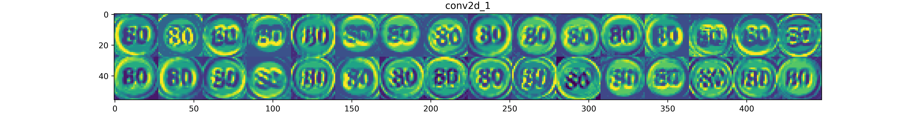
</p>
<p align="center">
  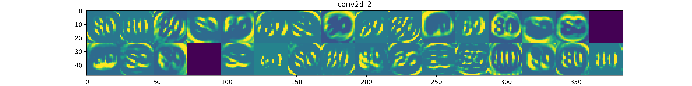
</p>
<p align="center">
  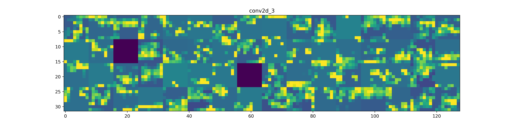
</p>
<p align="center">
  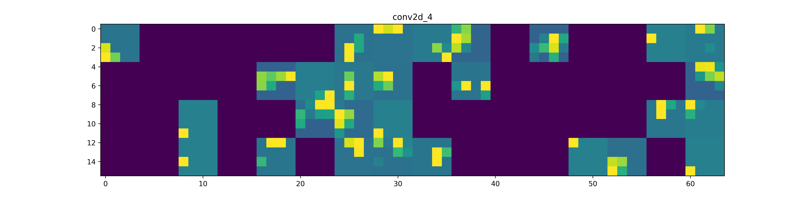
</p>
<p align="center">
  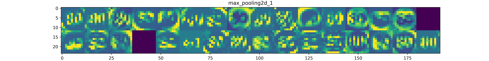
</p>
<p align="center">
  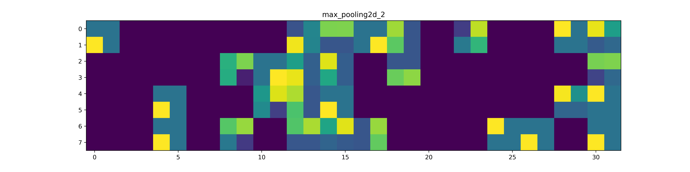
</p>

## Visualizing convnets filters
This can be done with gradient ascent in input space: applying gradient descent to the value of the input image of a convnet so as to maximize the response of a specific filter, starting from a blank input image. The resulting input image will be one that the chosen filter is maximally responsive to.
<p align="center">
          
</p>
<p align="center">
          
</p>

# Conclusion and Future Extensions to the Project
We presented a Convolutional Network architecture with state-of-the-art results on the **GTSRB traffic sign dataset** implemented with the `keras deep learning library`. Using `Deep LeNet-5 + Contrast Enhancement + Augmentation(4500) + Regularization` architecture, `99.22%` accuracy is obtained which surpassed the best human performance of `98.84%` :smiley:.The proposed algorithm has more **admirable accuracy, better real-time performance, stronger generalization ability and higher training efficiency** than other algorithms. The accurate recognition rate and average processing time are significantly improved.

Future work should investigate the impact of deeper layers. The impact of input resolution should be studied to improve both accuracy and processing speed. More diverse training set deformations can also be investigated such as brightness, contrast, shear and blur perturbations to address the numerous real-world deformations. In the future, the inclusiveness and anti-error recognition of the traffic sign recognition algorithm can be further optimized and improved to exploit the overall performance of the algorithm.

# References
1. J. Stallkamp, M. Schlipsing, J. Salmen, and C. Igel. [The German Traffic Sign Recognition Benchmark: A multi-class classification competition](https://ieeexplore.ieee.org/document/6033395). In Proceedings of the IEEE
International Joint Conference on Neural Networks, pages 14531460. (2011).
2. LeCun, Y., Bottou, L., Bengio, Y., and Haffner, P. [Gradient-based learning applied to document recognition](https://ieeexplore.ieee.org/document/726791). Proceedings of the IEEE, 86(11), 2278–2324. (1998).
3. Haloi, M.  [A novel pLSA based Traffic Signs Classification System](https://arxiv.org/abs/1503.06643) (2015).
4.  M. Haloi. [Traffic sign classification using deep inception based convolutional networks](https://arxiv.org/abs/1511.02992) (Nov. 2015).
5.   Sermanet, P., LeCun, Y. [Traffic sign recognition with multi-scale convolutional
networks](https://ieeexplore.ieee.org/document/6033589). In Neural Networks (IJCNN), The 2011 International Joint Conference on (pp. 2809-2813). IEEE (2011)
